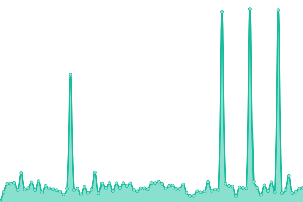

# [📈 Live Status](https://tensioncore.github.io/rasberry): <!--live status--> **🟩 All systems operational**

This Repository tracks Rasberry.ca and Tensioncore.com uptime.

<!--start: status pages-->
<!-- This summary is generated by Upptime (https://github.com/upptime/upptime) -->
<!-- Do not edit this manually, your changes will be overwritten -->
<!-- prettier-ignore -->
| URL | Status | History | Response Time | Uptime |
| --- | ------ | ------- | ------------- | ------ |
|  [Rasberry](https://rasberry.ca) | 🟩 Up | [rasberry.yml](https://github.com/tensioncore/rasberry/commits/HEAD/history/rasberry.yml) | 

 626ms
     
 | 

<a href="https://tensioncore.github.io/rasberry/history/rasberry">100.00%</a>
    

|  [Tensioncore](https://tensioncore.com) | 🟩 Up | [tensioncore.yml](https://github.com/tensioncore/rasberry/commits/HEAD/history/tensioncore.yml) | 

 573ms
     
 | 

<a href="https://tensioncore.github.io/rasberry/history/tensioncore">87.44%</a>
    

<!--end: status pages-->

[**Visit our status website →**](https://tensioncore.github.io/rasberry)

## 📄 License

- Powered by: [Upptime](https://github.com/upptime/upptime)
- Code: [MIT](./LICENSE) © [Upptime](https://upptime.js.org)
- Data in the `./history` directory: [Open Database License](https://opendatacommons.org/licenses/odbl/1-0/)
